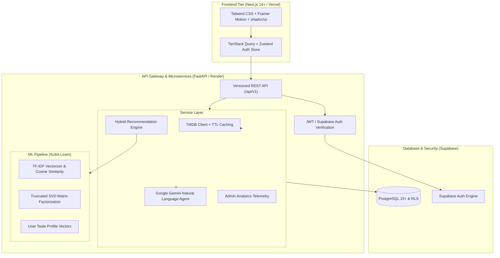

# CineMatch AI 🎬✨

> **"Find your next obsession."**  
> A production-grade full-stack AI Movie Recommendation and Natural Language Discovery Platform.

[](https://github.com/your-username/cinematch-ai/actions)
[](https://opensource.org/licenses/MIT)
[](https://fastapi.tiangolo.com)
[](https://nextjs.org)
[](https://python.org)
[](https://supabase.com)

---

## 🌟 Key Platform Features

- **Dynamic Hybrid Recommendation Engine**: Multi-tier ranking combining Scikit-Learn TF-IDF feature vectors, Truncated SVD matrix factorization, live user taste vectors, community rating signals, and popularity recency.
- **Google Gemini Conversational Discovery**: Translates natural language prompts (*"I want a mind-bending sci-fi like Interstellar but not too long"*) into validated structured intent schemas for hybrid ranking.
- **Transparent Explainability**: Every recommendation includes mathematically grounded "Why you'll like this" signals and honest match percentages.
- **Interactive Cold-Start Onboarding**: Starter genre and era taste calibration ensures brand-new users immediately receive personalized recommendations.
- **Movie Details & Video Trailers**: Rich TMDB metadata, HD backdrops, cast & director info, interactive 1–5 star rating widget, and embedded video trailer modals.
- **User Taste Profile & Analytics**: Real-time visual radar charts and rating distribution histograms powered by Recharts.
- **Admin Control Center**: Telemetry dashboard tracking system latency, active users, ratings histograms, and movie catalog oversight.
- **Deployment-Ready Architecture**: Monorepo layout configured for zero-code-change deployment on **Vercel** (Frontend), **Render** (Backend), and **Supabase** (Database & Auth).

---

## 🏗️ System Architecture



---

## 🧮 Recommendation Formula & Weights

CineMatch AI computes candidate movie ranking using an adaptive hybrid scoring function:

$$\text{Score} = (w_c \times S_{\text{content}}) + (w_{cf} \times S_{\text{collab}}) + (w_u \times S_{\text{user}}) + (w_r \times S_{\text{rating}}) + (w_p \times S_{\text{recency}})$$

### Cold-Start Adaptive Balance:
- **New User (0 ratings)**: $w_c = 0.30, w_{cf} = 0.00, w_u = 0.40, w_r = 0.20, w_p = 0.10$
- **Warm User (1–4 ratings)**: $w_c = 0.35, w_{cf} = 0.15, w_u = 0.25, w_r = 0.15, w_p = 0.10$
- **Mature Profile (5+ ratings)**: $w_c = 0.40, w_{cf} = 0.30, w_u = 0.15, w_r = 0.10, w_p = 0.05$

---

## 📂 Repository Layout

```
cinematch-ai/
├── backend/
│   ├── app/
│   │   ├── api/v1/endpoints/  # API resource endpoints (auth, movies, recs, search, ai, etc.)
│   │   ├── core/              # Config, database, errors, logging, security
│   │   ├── models/            # SQLAlchemy database models
│   │   ├── schemas/           # Pydantic v2 schemas
│   │   ├── services/          # TMDB, Gemini, RecEngine, Admin services
│   │   └── main.py            # FastAPI main application
│   ├── ml/
│   │   ├── preprocessing/     # Text normalizer & feature soup builder
│   │   ├── inference/         # Content, Collaborative, and Hybrid engines
│   │   ├── training/          # Model training scripts
│   │   └── evaluation/        # Model benchmark evaluation suite
│   ├── supabase/
│   │   ├── migrations/        # Initial schema, tables, indexes, RLS policies
│   │   └── seed.sql           # Curated seed movie dataset
│   ├── scripts/
│   │   └── ingest_movies.py   # TMDB Movie Ingestion CLI
│   ├── tests/                 # Full pytest test suite
│   ├── Dockerfile
│   └── requirements.txt
├── frontend/
│   ├── src/
│   │   ├── app/               # Next.js 14 App Router routes
│   │   ├── components/        # UI primitives, Movie cards, Hero, Charts, AI dialog
│   │   ├── hooks/             # TanStack Query & Zustand hooks
│   │   ├── lib/               # API client, Supabase client, formatting utilities
│   │   └── types/             # TypeScript interfaces
│   ├── package.json
│   ├── tailwind.config.ts
│   └── tsconfig.json
├── docs/
│   ├── ARCHITECTURE.md        # Deep architecture breakdown
│   ├── API.md                 # Complete REST API reference
│   ├── DATABASE.md            # Schema, ER diagram, and RLS guide
│   ├── ML.md                  # Machine learning methodology & formulas
│   ├── DEPLOYMENT.md          # Step-by-step Vercel, Render & Supabase deployment
│   ├── project-report.md      # Academic final-year project report
│   └── VIVA.md                # Technical viva examination Q&A guide
├── .github/workflows/ci.yml   # GitHub Actions CI workflow
├── docker-compose.yml         # Local multi-container development
├── render.yaml                # Render Blueprint deployment specification
├── .env.example               # Environment variables template
└── README.md
```

---

## 🚀 Quickstart Local Development

### 1. Backend Setup
```bash
cd backend
python -m venv venv
# On Windows:
.\venv\Scripts\activate
# On Linux/macOS:
source venv/bin/activate

pip install -r requirements.txt
cp ../.env.example .env
uvicorn app.main:app --reload --port 8000
```
API Documentation will be available at `http://localhost:8000/docs`.

### 2. Frontend Setup
```bash
cd frontend
npm install
npm run dev
```
Open `http://localhost:3000` in your browser.

---

## 🧪 Testing & Model Evaluation

### Run Backend Unit Tests:
```bash
cd backend
python -m pytest -v
```

### Train and Evaluate ML Pipeline:
```bash
cd backend
python ml/training/train_content_model.py
python ml/training/train_collaborative_model.py
python ml/evaluation/evaluate_model.py
```

---

## ☁️ Production Deployment Guide

| Component | Platform | Configuration |
| :--- | :--- | :--- |
| **Frontend** | **Vercel** | Set Root Directory to `frontend`. Configure `NEXT_PUBLIC_API_URL` to your Render backend URL. |
| **Backend** | **Render** | Connect GitHub repo via `render.yaml` or set Root Directory to `backend` with build `pip install -r requirements.txt` and start `uvicorn app.main:app --host 0.0.0.0 --port $PORT`. |
| **Database** | **Supabase** | Run `backend/supabase/migrations/20240101000000_initial_schema.sql` in Supabase SQL editor. |

Detailed instructions are available in [docs/DEPLOYMENT.md](file:///C:/Users/Asus/.gemini/antigravity/scratch/cinematch-ai/docs/DEPLOYMENT.md).

---

## 📜 TMDB Attribution & License

This product uses the TMDB API but is not endorsed or certified by TMDB. Movie metadata, images, and artwork are provided by [The Movie Database (TMDB)](https://www.themoviedb.org).

Released under the **MIT License**.
