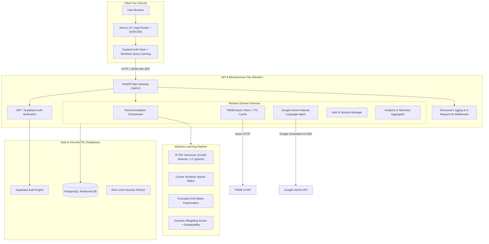

# CineMatch AI - System Architecture Documentation

## 1. Executive Architecture Summary

CineMatch AI is designed as a decoupled, multi-tier, production-ready AI Movie Recommendation & Discovery Platform. The frontend is built on **Next.js 14+ (App Router)** and deployed to **Vercel**, while the backend is an asynchronous, versioned REST API built on **FastAPI (Python 3.11+)** and deployed to **Render**. Persistent relational data, Row Level Security (RLS), and authentication are managed through **Supabase PostgreSQL**.

---

## 2. High-Level Architectural Flow

---

## 3. Decoupling Principles & Modularity

1. **Recommendation Independence**: The recommendation algorithms (`ContentEngine`, `CollaborativeEngine`, `HybridRecommender`) reside in `backend/ml/` and are isolated from the web framework. Algorithms can be trained, benchmarked, or upgraded without modifying web routing or database schema code.
2. **Resilient Fallback Design**:
   - If Google Gemini API is offline or rate-limited, the system falls back to an intelligent heuristic NLP parser.
   - If TMDB API is offline or unconfigured, the system serves preloaded high-fidelity seed movie masterworks.
   - If collaborative filtering lacks user support (Cold Start), weights dynamically rebalance toward user onboarding preferences and content vectors.
3. **Multi-Platform Deployment-Ready**:
   - `frontend/` builds as a standard standalone Vercel Next.js web application.
   - `backend/` builds as a containerized or native Python application on Render using dynamic `$PORT` binding.
