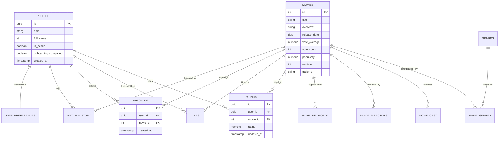

# CineMatch AI - Database Schema & Architecture

## 1. Overview

CineMatch AI uses **Supabase PostgreSQL** as its primary relational datastore. The schema is fully normalized, indexed for high-volume read queries, and secured using **Row Level Security (RLS)** policies.

---

## 2. Entity-Relationship Diagram

---

## 3. Key Constraints & Performance Indexes

1. **Unique Interaction Constraints**:
   - `ratings`: `UNIQUE(user_id, movie_id)` (Guarantees one active rating per movie per user).
   - `likes`: `UNIQUE(user_id, movie_id)`
   - `watchlist`: `UNIQUE(user_id, movie_id)`
2. **Indexes**:
   - `idx_movies_popularity`: Fast retrieval of globally trending films.
   - `idx_movies_vote_average`: Accelerates top-rated catalog queries.
   - `idx_movies_title`: GIN full-text search index on movie titles.
   - `idx_ratings_user`: Instant user vector compilation during recommendation requests.
3. **Row Level Security (RLS)**:
   - Public read access on movies, genres, cast, and directors.
   - Strict authenticated ownership on profiles, ratings, watchlist, and history (`auth.uid() = user_id`).
